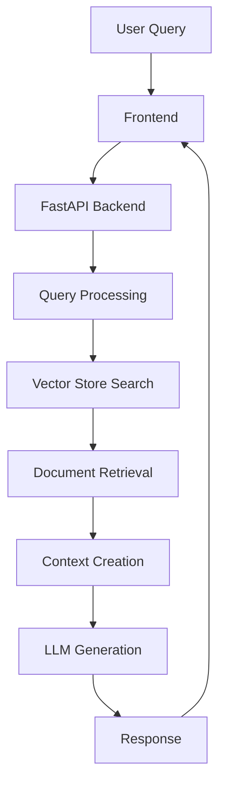
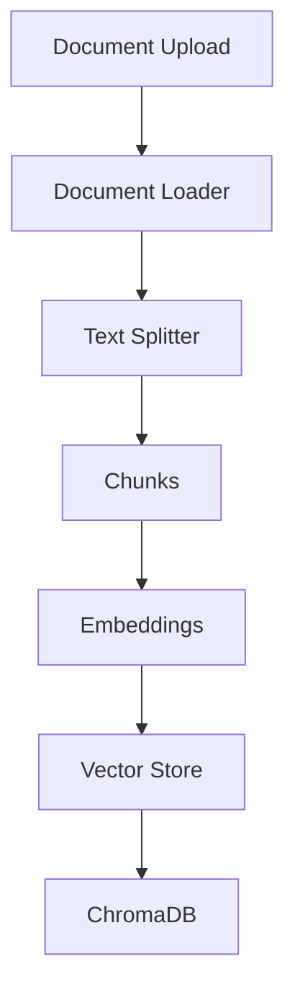
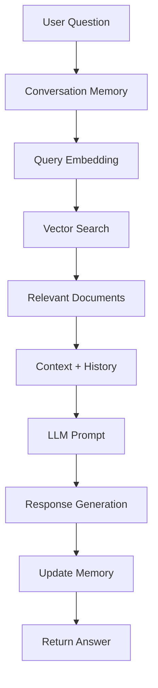

# UNC RAG System Workflow

## System Architecture

## Document Processing Flow

## Query Processing Flow

## Components Description

1. **Frontend (Next.js)**
   - Handles user interface
   - Manages conversation state
   - Displays responses and sources

2. **Backend (FastAPI)**
   - Processes user queries
   - Manages conversation memory
   - Coordinates document retrieval
   - Handles LLM interactions

3. **Vector Store (ChromaDB)**
   - Stores document embeddings
   - Enables semantic search
   - Maintains document metadata

4. **LLM Integration**
   - Uses GPT-4 for response generation
   - Incorporates conversation history
   - Provides context-aware answers

5. **Document Processing**
   - Loads and processes .docx files
   - Splits documents into chunks
   - Generates embeddings
   - Stores in vector database

## Data Flow

1. **Initial Setup**
   - Documents are processed and embedded
   - Vector store is initialized
   - Conversation memory system is ready

2. **Query Processing**
   - User submits question
   - System retrieves conversation history
   - Relevant documents are fetched
   - Context is created
   - LLM generates response
   - Memory is updated
   - Response is returned to user

3. **Memory Management**
   - Each conversation has unique ID
   - History is maintained per conversation
   - Context is preserved across queries 